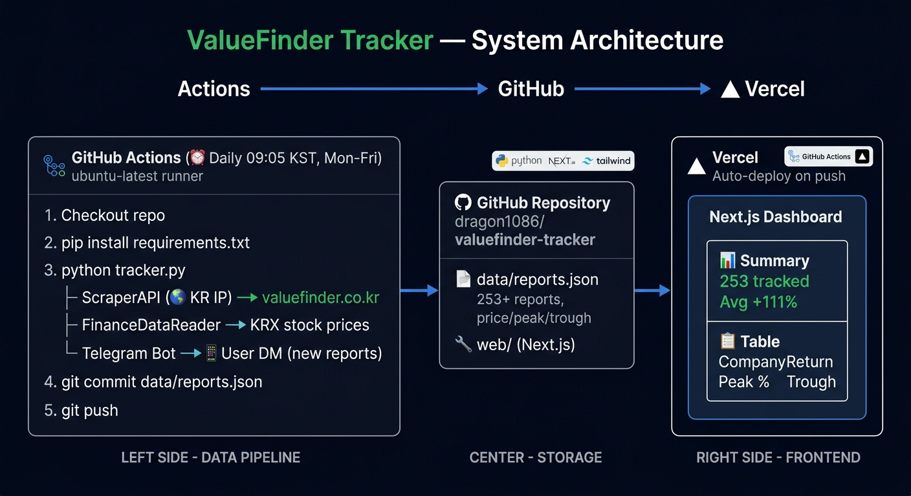

<p align="center">
  <picture>
    <source media="(prefers-color-scheme: dark)" srcset="web/public/logo-dark.png">
    <source media="(prefers-color-scheme: light)" srcset="web/public/logo.png">
    
  </picture>
</p>

<p align="center">
  <strong>🌐 Live: <a href="https://valuefinder-tracker.vercel.app">valuefinder-tracker.vercel.app</a></strong>
</p>

[ValueFinder](https://valuefinder.co.kr)에서 발행하는 기업분석 리포트를 자동으로 추적하고, 리포트 작성일 기준 수익률을 매일 업데이트하는 오픈소스 프로젝트입니다.


## ✨ 주요 기능

- 📋 **자동 크롤링** — ValueFinder 신규 리포트 감지 및 텔레그램 알림
- 📈 **수익률 추적** — 리포트 작성일 기준 현재가 대비 수익률 계산
- 🏆 **최고가/최저가** — 리포트 작성일 이후 최대 수익/손실 구간 추적
- 🤖 **완전 자동화** — GitHub Actions로 매일 09:05 KST 자동 실행
- 🌐 **웹 대시보드** — Vercel로 배포되는 Next.js 대시보드

## 🏗 아키텍처



- **DB 없음** — `data/reports.json` 하나로 모든 상태 관리 (Git as Database)
- **Mac 불필요** — GitHub Actions 서버에서 완전 독립 실행
- **ScraperAPI** — 한국 IP 우회 크롤링 (무료 1,000 크레딧/월, 하루 44 크레딧 사용)

## 🚀 배포 방법

### 1. 레포지토리 Fork

```bash
git clone https://github.com/dragon1086/valuefinder-tracker.git
cd valuefinder-tracker
```

### 2. GitHub Secrets 등록

레포 → Settings → Secrets and variables → Actions → New repository secret

| Secret | 설명 |
|--------|------|
| `TELEGRAM_BOT_TOKEN` | 텔레그램 봇 토큰 (BotFather에서 발급) |
| `TELEGRAM_CHAT_ID` | 알림 받을 텔레그램 chat_id |
| `SCRAPER_API_KEY` | [ScraperAPI](https://scraperapi.com) API 키 (무료 1,000 크레딧/월) |

### 3. Vercel 배포

1. [vercel.com](https://vercel.com) → New Project
2. 이 레포 선택
3. **Root Directory: `web`** 설정
4. Deploy

### 4. GitHub Actions 수동 테스트

레포 → Actions → `Update ValueFinder Data` → Run workflow

## 💻 로컬 실행

```bash
# Python 의존성 설치
pip install -r requirements.txt

# .env.local 생성
cp .env.local.example .env.local
# TELEGRAM_BOT_TOKEN, TELEGRAM_CHAT_ID 입력

# 크롤러 실행
python tracker.py

# 웹 개발 서버
cd web
npm install
npm run dev
```

## 📦 기술 스택

| 역할 | 기술 |
|------|------|
| 크롤링 | Python + BeautifulSoup + ScraperAPI |
| 주가 데이터 | [FinanceDataReader](https://github.com/FinanceData/FinanceDataReader) (KRX) |
| 자동화 | GitHub Actions |
| 프론트엔드 | Next.js 15 + Tailwind CSS |
| 배포 | Vercel |
| 알림 | Telegram Bot API |

## 📄 라이선스

[MIT License](LICENSE)
